# Telecom Customer Churn Analysis

## Overview
This project analyses customer churn in a telecommunications company to identify key drivers and build predictive models that detect at-risk customers.

## Business Objectives
The primary goal is to support the telecom company in reducing its **26.5% churn rate**, which currently exceeds the industry benchmark. Key objectives include:
* **Exploratory Data Analysis (EDA):** Identify key factors influencing churn.
* **Churn Prediction:** Develop machine learning models to detect high-risk customers.
* **Strategic Recommendations:** Propose data-driven retention strategies to improve profitability.

## Methodology
Customer churn was analysed using **Python**, combining data cleaning, exploratory analysis, and machine learning. Predictive models were used to identify at-risk customers, while clustering techniques enabled customer segmentation for targeted retention strategies.

## Key Insights
The telecom company is experiencing a **high churn rate (26.5%)**, exceeding the industry benchmark (15–22%).

The analysis revealed several critical determinants of churn:

* **Demographics:** Senior citizens churn at 41.7% (nearly double the rate of younger demographics). Additionally, customers without partners or dependents show a higher propensity to leave.

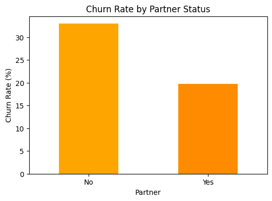
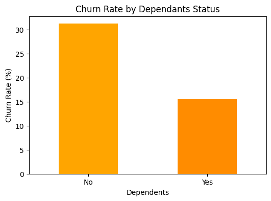

* **Customer Tenure:** New customers (0-12 months) exhibit a 47.7% churn rate, indicating a need for better early-stage engagement.

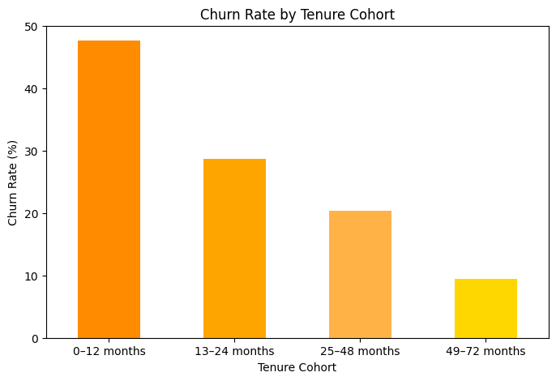

* **Internet Service:** Fiber-optic users are significantly more prone to churn (41.9%) compared to DSL users. This suggests high price sensitivity or dissatisfaction with premium-tier pricing.

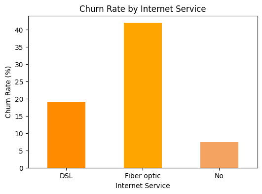

* **Contract Type:** Customers on month-to-month contracts have the highest churn rate (42.7%), whereas two-year contracts offer the most stability (2.85%).

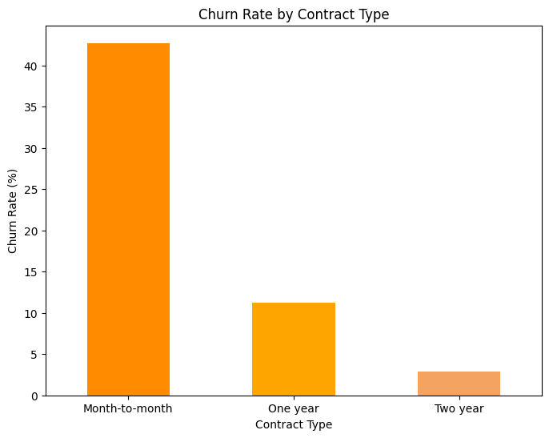

* **Monthly Charges Distribution:** High-paying customers churn more, further confirming that price sensitivity is a primary driver.

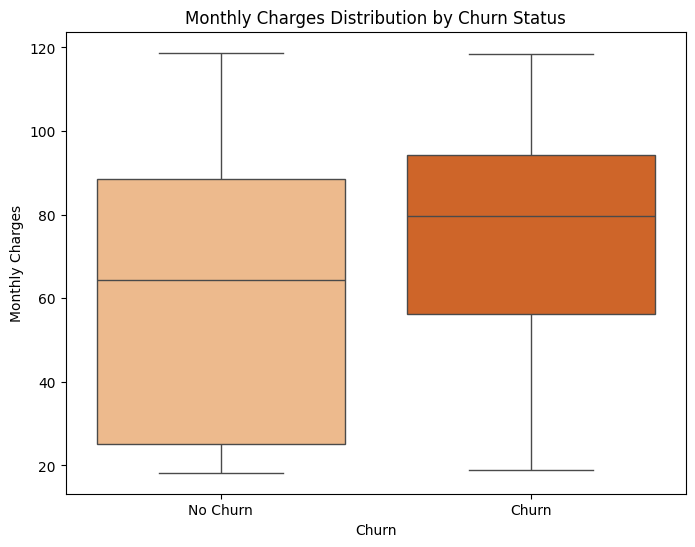

* **Payment and Billing Behavior:** Electronic check payments and paperless billing are strongly associated with increased churn.

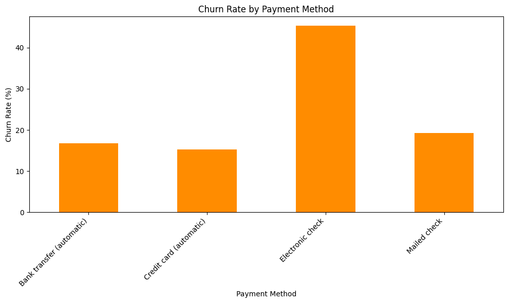
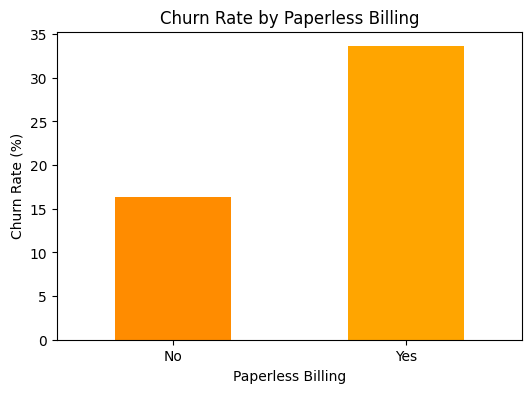

## Methodology & Models
Several predictive models were developed and evaluated, including **Logistic Regression, Decision Tree, Random Forest, and XGBoost**.

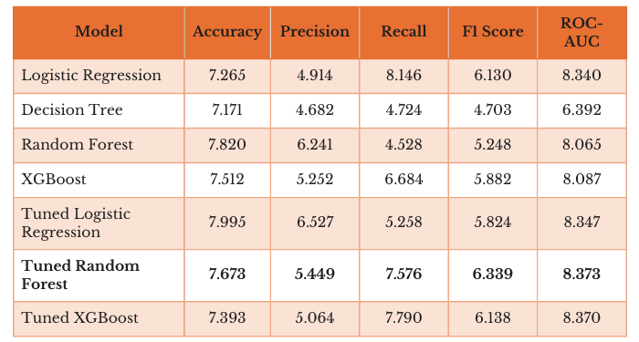

* **Top Performer:** The **tuned Random Forest model** was identified as the most suitable for operational use due to its balance of accuracy and business efficiency.

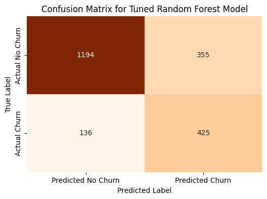

* **Feature Importance:** Top predictors are Tenure, Total Charges, Internet Service, Contract and Payment Method.

* **Segmentation:** K-means clustering was used to create risk-based customer groups for targeted outreach.

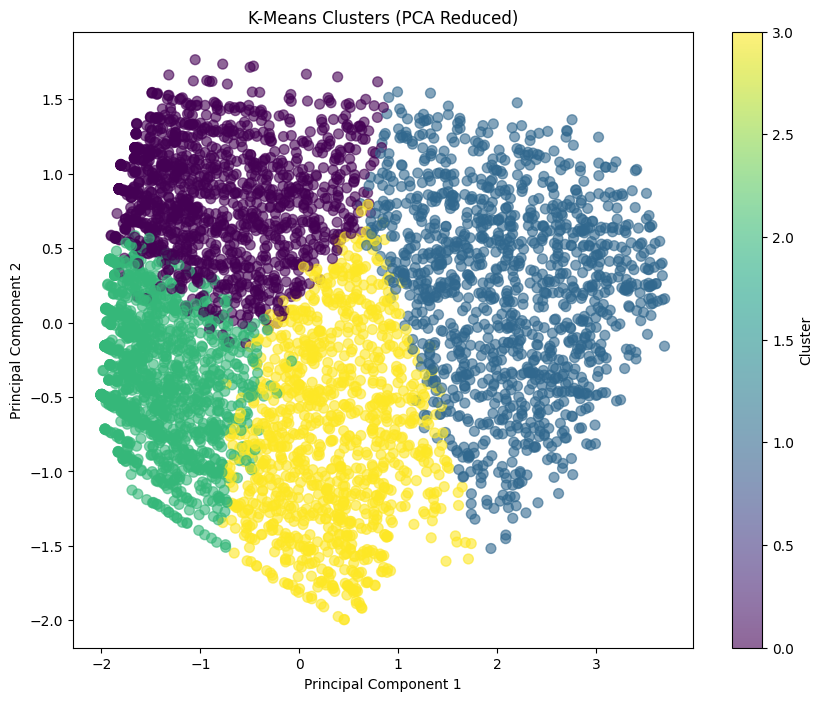

## Recommendations
* Implement a multi-layered retention strategy focusing on early-stage onboarding for new customers.
* Encourage shifts toward long-term contracts and automatic payment methods.
* Improve fiber service quality and transparency regarding high-cost plan pricing.
* Develop a model-driven early warning system for proactive customer engagement.
